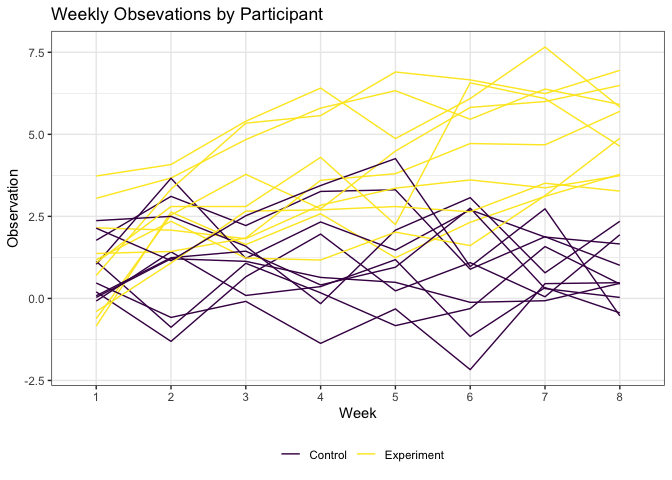
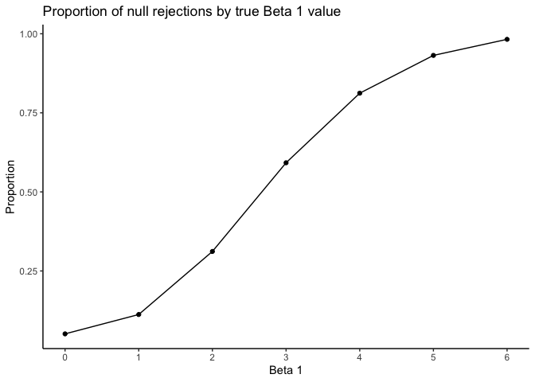
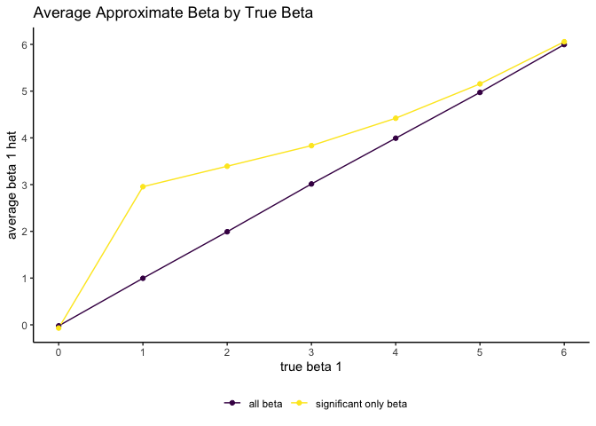

Homework 5
================
Charlotte Fowler
11/8/2019

# Problem 1

``` r
#loading packages
library(tidyverse)
```

    ## ── Attaching packages ────────────────────────────────────────────────────────────────── tidyverse 1.2.1 ──

    ## ✔ ggplot2 3.2.1     ✔ purrr   0.3.2
    ## ✔ tibble  2.1.3     ✔ dplyr   0.8.3
    ## ✔ tidyr   1.0.0     ✔ stringr 1.4.0
    ## ✔ readr   1.3.1     ✔ forcats 0.4.0

    ## ── Conflicts ───────────────────────────────────────────────────────────────────── tidyverse_conflicts() ──
    ## ✖ dplyr::filter() masks stats::filter()
    ## ✖ dplyr::lag()    masks stats::lag()

``` r
#reading in data
set.seed(10)

iris_with_missing = iris %>% 
  map_df(~replace(.x, sample(1:150, 20), NA)) %>%
  mutate(Species = as.character(Species))
```

``` r
#writing function to fill in missing values
missing_values_fix = function(x){
  if (is.numeric(x)) {
    ifelse(is.na(x), mean(x, na.rm = TRUE), x)
  } else if (is.character(x)) {
    ifelse(is.na(x), "virginica", x)
  }
  

}

#performing function on iris data
output = map(iris_with_missing, missing_values_fix)


#creating new data
iris_data = tibble(
  sepal_length = output[[1]], 
  sepal_width = output[[2]],
  petal_length = output[[3]],
  petal_width = output[[4]],
  species = output[[5]]
)
```

# Problem 2

``` r
#reading in and tidying the data
file_names = list.files("data")

combined_df = map_dfr(.x = file_names, ~ read_csv(str_c("data/",.x)))

combined_df = combined_df %>% 
  mutate(
    id = file_names
  ) %>% 
  separate(id, into = c("group", "id"), sep = "_") %>% 
  mutate(id = str_remove(id, ".csv")) %>% 
  pivot_longer(week_1:week_8, names_to = "week", values_to = "value") %>% 
  mutate(week = str_remove(week, "week_"))
```

``` r
#making spaghetti plot
combined_df %>% 
  mutate(unique_id = paste(id, group, sep = "_")) %>% 
  ggplot(aes(y = value, x = week, group = unique_id, color = group)) +
  geom_line() + 
  viridis::scale_color_viridis(
    discrete = TRUE, 
    name = "",
    breaks=c("con", "exp"),
    labels=c("Control", "Experiment")
    ) + 
  theme_bw() + 
  labs(title = "Weekly Obsevations by Participant", y = "Observation", x = "Week") + 
  theme(legend.position = "bottom") 
```

<!-- -->

It appears that the control group tended to have lower values than the
experiment group, especially as time progressed.

# Problem 3

``` r
#writing function to run regression 
sim_regression = function(beta1, n = 30, beta0 = 2) {
  
  sim_data = tibble(
    x = rnorm(n),
    y = beta0 + beta1 * x + rnorm(n, 0, sqrt(50)) 
  )
  
  ls_fit = broom::tidy(lm(y ~ x, data = sim_data))
  
  tibble(
    beta1_hat = pull(ls_fit, estimate)[2],
    beta1_hat_pvalue = pull(ls_fit, p.value)[2]
  )
}
```

``` r
#running simulation 10000 for beta1 = 0 
output = vector("list", 10000)

for (i in 1:10000) {
  output[[i]] = sim_regression(0)
}

results_b1_0 = bind_rows(output)
```

``` r
#running sim for beta1 ={0,1,2,3,4,5,6}
sim_results = 
  tibble(beta1 = 0:6) %>% 
  mutate(
    output_lists = map(.x = beta1, ~rerun(10000, sim_regression(beta1 = .x))),
    estimate_dfs = map(output_lists, bind_rows)) %>% 
  select(-output_lists) %>% 
  unnest(estimate_dfs)
```

``` r
#plotting proportion of rejections by beta1
sim_results %>% 
  group_by(beta1) %>% 
  filter(beta1_hat_pvalue<0.05) %>% 
  count() %>% 
  mutate(prop = n/10000) %>% 
  ggplot(aes(y = prop, x = beta1)) +
  geom_line() +
  geom_point() + 
  labs(title = "Proportion of null rejections by true Beta 1 value", y = "Proportion") + 
  theme_classic() +
  scale_x_continuous(name="Beta 1", breaks=0:6) 
```

<!-- -->

As effect size (beta 1) increases, the probability we reject the null
approaches 1, and therefore the power increases significantly. By the
time beta 1 is 6 given the experiment conditions, we are almost certain
to reject the null.

``` r
#calculating avg beta hat
all_beta_avgs = sim_results %>% 
  group_by(beta1) %>% 
  summarise(all_beta1 = mean(beta1_hat))  

#calculating avg sig beta hat
sig_beta_avgs = sim_results %>% 
  filter(beta1_hat_pvalue<0.05) %>% 
  group_by(beta1) %>% 
  summarise(sig_beta1 = mean(beta1_hat))  
  
#creating graph of average betas
left_join(all_beta_avgs, sig_beta_avgs, by = "beta1") %>% 
  pivot_longer(cols = c(all_beta1, sig_beta1), names_to = "type", values_to = "avg") %>% 
  ggplot(aes(x = beta1, y = avg, color = type)) + 
  geom_line() +
  geom_point() + 
  labs(title = "Average Approximate Beta by True Beta") + 
  viridis::scale_color_viridis(
    discrete = TRUE, 
    name = "",
    breaks=c("all_beta1", "sig_beta1"),
    labels=c("all beta", "significant only beta")) + 
  theme_classic() +
  scale_x_continuous(name="true beta 1", breaks=0:6) + 
  scale_y_continuous(name="average beta 1 hat", breaks=0:6) + 
  theme(legend.position = "bottom") 
```

<!-- -->

The average beta 1 hat tends to be larger among those which rejected the
mean. This is especially true among lower values of beta 1. For these,
the null will only be rejected if the sampled beta 1 is much larger than
0, and therefore larger than the true beta 1. For larger values of beta
1 the null is almost always rejected, as the effect size is already
large. Therefore, as beta 1 increases, the average of all approximate
beta’s approaches that of the only those which rejected the mean. When
the true beta is 0, we are equally likely to reject because of very
large or very small values, and this results in the two averages being
essentially equal.
